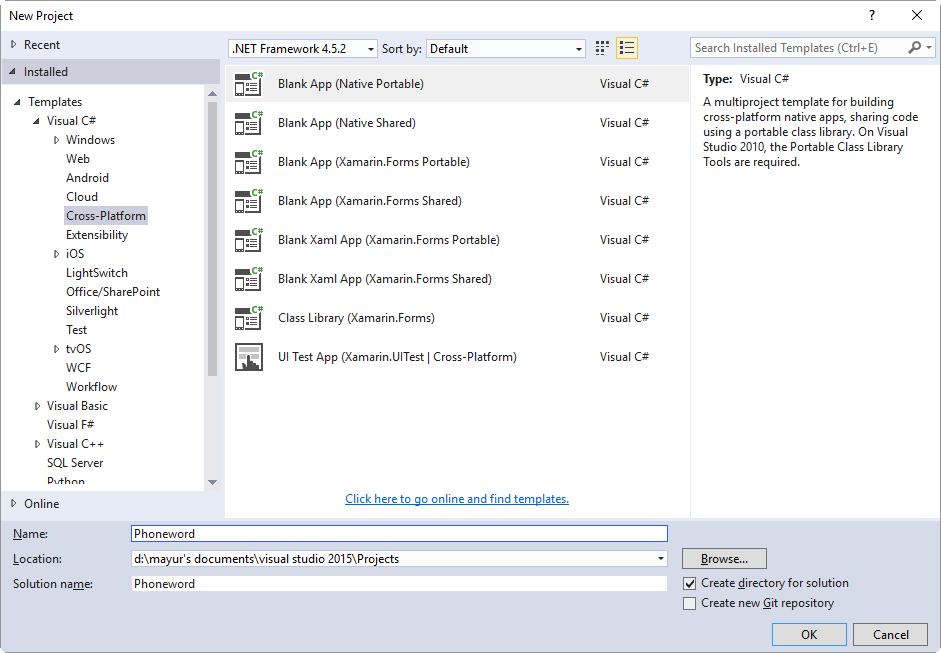
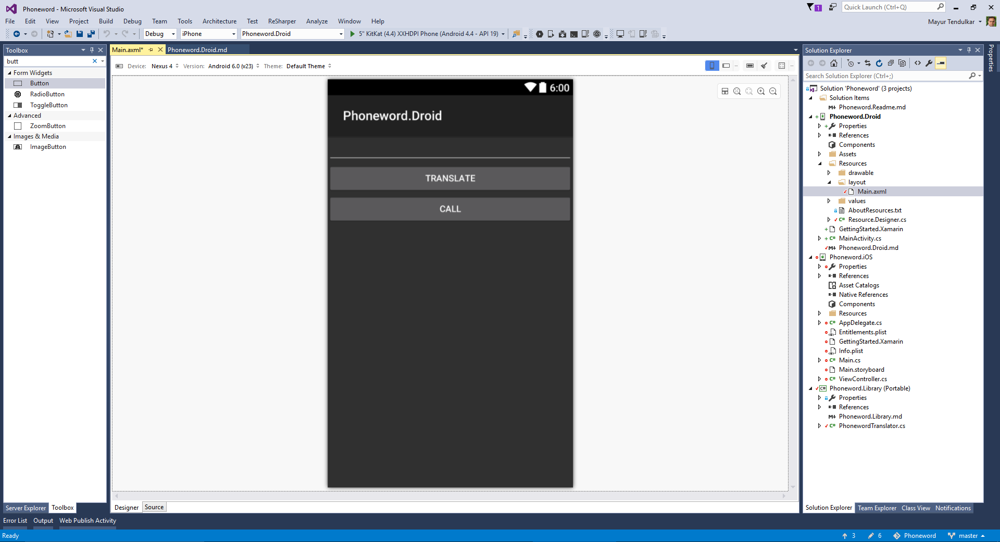
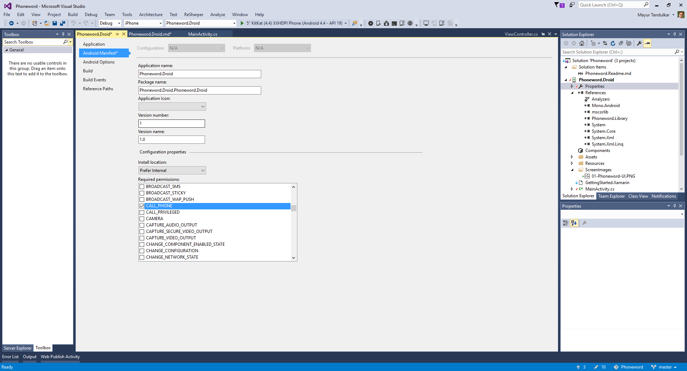
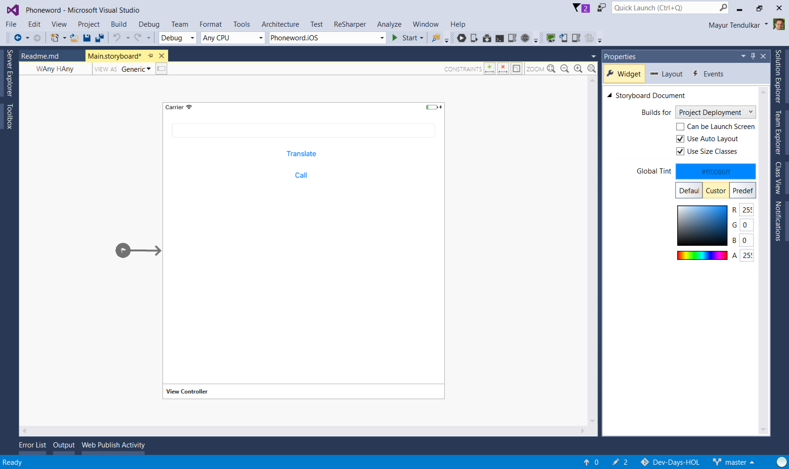

This project has been cloned from the Xamarin repo and is one of the quickstart examples. 

#### Phoneword - 'Hello World' for Mobile Developers

When someone starts to learn programming, the first chapter is always a 'Hello World', be it printing it in C/C++, displaying it in HTML web page or popup message box in desktop application. 

As this lab is aimed for mobile applications, let's build a mobile app which will make use phone functionality and make a phone call.

#### Overview

This lab will cover creating an Android & iOS apps for making a phone call. 

#### Requirements

This lab requires Xamarin components installed on Mac or on Windows. Download or clone this repository to start executing the lab. 

## Building Phoneword App ##

You can open existing Phoneword application from this repository or create a cross-platform 'Blank App (Native Portable)'. This will create projects for Portable Class Library, Android and iOS. 



Now, let's build these projects individually. 

## Phoneword (Portable Class Library)

- Open `MyClass.cs` from Phoneword (PCL) or add a new class to this project and rename it to `PhonewordTranslator.cs` 
- In the class add following code

```csharp
public static class PhonewordTranslator
{
	public static string ToNumber(string raw)
	{
		if (string.IsNullOrWhiteSpace(raw))
			return "";
		else
			raw = raw.ToUpperInvariant();

		var newNumber = new StringBuilder();
       	foreach (var c in raw)
		{
			if (" -0123456789".Contains(c))
				newNumber.Append(c);
			else {
				var result = TranslateToNumber(c);
              if (result != null)
					newNumber.Append(result);
			}
           // otherwise we've skipped a non-numeric char
		}
       	return newNumber.ToString();
	}

	static bool Contains (this string keyString, char c)
	{
		return keyString.IndexOf(c) >= 0;
	}

	static int? TranslateToNumber(char c)
	{
		if ("ABC".Contains(c))
			return 2;
		else if ("DEF".Contains(c))
			return 3;
		else if ("GHI".Contains(c))
			return 4;
		else if ("JKL".Contains(c))
			return 5;
		else if ("MNO".Contains(c))
			return 6;
		else if ("PQRS".Contains(c))
			return 7;
		else if ("TUV".Contains(c))
			return 8;
		else if ("WXYZ".Contains(c))
			return 9;
		return null;
	}
}
```


## Phoneword for Android

**Overview**

In this lab, attendees will build their first Android application which will translate the Phoneword and make a phone call. 

**Open Phoneword.Droid Project**

There are three steps to complete this project

**Step 1: Creating User Interface**

- Open existing `Phoneword.Droid` project and locate Main.axml within `Resources > Layout` folder. 
- Use drag and drop feature to create user interface for Phoneword. 
- Add `EditText` to enter the Phoneword. Name it as 'PhonewordText'
- Use `Button` to translate this Phoneword to a valid phone number. Name it as `TranslateButton` & set Text peroprty to **Translate**
- Use `Button` to call this translated number. Name it as `CallButton` & set the Text property to **Call**
- The UI should look like this:



- Alternatively, use following code to create this this UI

```xml
<?xml version="1.0" encoding="utf-8"?>
<LinearLayout xmlns:android="http://schemas.android.com/apk/res/android"
    android:orientation="vertical"
    android:layout_width="match_parent"
    android:layout_height="match_parent"
    android:minWidth="25px"
    android:minHeight="25px">
    <EditText
        android:layout_width="match_parent"
        android:layout_height="wrap_content"
        android:id="@+id/PhonewordText" />
    <Button
        android:text="Translate"
        android:layout_width="match_parent"
        android:layout_height="wrap_content"
        android:id="@+id/TranslateButton" />
    <Button
        android:text="Call"
        android:layout_width="match_parent"
        android:layout_height="wrap_content"
        android:id="@+id/CallButton" />
</LinearLayout>
```

**Step 2: Adding code behind**


- Add a reference to Phoneword (Library) to Android Project
- In `MainActivity.cs` write following code above constructor. 

```csharp
 EditText phoneNumberText;
 Button translateButton;
 Button callButton;
 string TranslatedNumber; 
```
- In `OnCreate()` method, set the layout file and assign controls to these variables. Along with it, set event handlers for the button.

```csharp
SetContentView (Resource.Layout.Main);
phoneNumberText = FindViewById<EditText>(Resource.Id.PhonewordText);
translateButton = FindViewById<Button>(Resource.Id.TranslateButton);
callButton = FindViewById<Button>(Resource.Id.CallButton);

translateButton.Click += TranslateButton_Click;
callButton.Click += CallButton_Click;
```

- Using the `PhonewordTranslator` class from Phoneword (Portable Class Library), translate the phoneword. This logic can be added in `TranslateButton` click event

```csharp
private void TranslateButton_Click(object sender, System.EventArgs e)
{
	TranslatedNumber = PhonewordTranslator.ToNumber(phoneNumberText.Text);
    if (string.IsNullOrWhiteSpace(TranslatedNumber))
    {
    	callButton.Text = "Call";
        callButton.Enabled = false;
	}
    else
    {
    	callButton.Text = "Call " + TranslatedNumber;
        callButton.Enabled = true;
	}
}
```
- Use `TranslatedNumber` to make phone call. Write that logic to make a phone call inside CallButton click event

```csharp
private void CallButton_Click(object sender, System.EventArgs e)
{
	var callDialog = new AlertDialog.Builder(this);
    callDialog.SetMessage("Call " + TranslatedNumber + "?");
    callDialog.SetNeutralButton("Call", delegate {
    	var callIntent = new Intent(Intent.ActionCall);
        callIntent.SetData(Android.Net.Uri.Parse("tel:" + TranslatedNumber));
        StartActivity(callIntent);
	});
    callDialog.SetNegativeButton("Cancel", delegate { });
    callDialog.Show();
}
```
**Step 3: Running the app**

Android applications require permissions to execute tasks like making a phone call. Open 'Properties' of the application and give permission to call.



Now run the app and see it in action.

## Phoneword for iOS ##

**Overview**

In this lab, attendees will build their first iOS application which will translate the Phoneword and make a phone call. 

**Creating Phoneword.iOS Project**

There are three steps to complete this project

**Step 1: Creating User Interface**

- Open existing Phoneword.iOS project and locate `Main.storyboard`. Make sure Visual Studio is connected to Mac to load the storyboard and build the iOS project.
- Use drag and drop feature to create user interface for Phoneword. 
- Add `Text Field` to enter the Phoneword. Name it as **PhonewordText**. Set the Text property to blank to empty the textbox.
- Use `Button` to translate this Phoneword to a valid phone number. Name it as **TranslateButton**. Set the text to **Translate**
- Use `Button` to call this translated number. Name it as **CallButton** & set the Text property to **Call**
- The UI should look like this:



**Step 2: Adding code behind**

- Add a reference to Phoneword (Library) to iOS Project
- In `ViewController.cs` write following code above constructor. 

```csharp
 string translatedNumber = "";
```
- In `ViewDidLoad()` method, add following code

```csharp
base.ViewDidLoad();
TranslateButton.TouchUpInside += (object sender, EventArgs e) =>
{
   // Convert the phone number with text to a number
   // using PhoneTranslator.cs
   translatedNumber = PhonewordTranslator.ToNumber(
                    PhonewordText.Text);
// Dismiss the keyboard if text field was tapped
   PhonewordText.ResignFirstResponder();
};
```

- Use `CallButton` event handler to make a phone call to translated number.

```csharp
CallButton.TouchUpInside += (object sender, EventArgs e) => 
{
   // Use URL handler with tel: prefix to invoke Apple's Phone app...
   var url = new NSUrl("tel:" + translatedNumber);
   if (!UIApplication.SharedApplication.OpenUrl(url))
   {
      var alert = UIAlertController.Create("Not supported", "Scheme 'tel:' is not supported on this device", UIAlertControllerStyle.Alert);
      alert.AddAction(UIAlertAction.Create("Ok", UIAlertActionStyle.Default, null));
      PresentViewController(alert, true, null);
    }
};
```
**Step 3: Running the app**

Now run the app and see it in action.

## INTEGRATING WITH HASURA ##

**Overview**

After you have created the simple Phoneword app. We will use Hasura to persist the translations that you do into a DB and then make another view to fetch all the saved translations.
 
**Step 1 : Setting up Hasura**

- Log into your Hasura console 
- Create a new table and call it "phoneword_translation"
- Add three columns to it -> "id" of type integer (auto increment),"character" of type String and "number" of type String.
- Click save.

**Step 2: Adding the Newtonsoft.Json Package**

- Right click on Packages.
- Select Add a Package.
- Search for Newtonsoft.Json and install it.

**Step 3: Creating the required object**

- Create a new PCL to handle each record from the "phoneword_translation" table. Call it "Translation Record" and add the following code to it.

```csharp
using Newtonsoft.Json;
namespace Phoneword
{
	public class TranslationRecord
	{

		[JsonProperty("character")]
		public string character;

		[JsonProperty("number")]
		public string number;
	}
}
```

- We can use a structure to handle our Endpoints. Create a new file and call it "Endpoint" and add the following to it.

```csharp 
using System;
namespace Phoneword
{
	public struct Endpoint
	{
		static string PROJECT_NAME = "armature32";
		static string DATA_URL = "https://data." + PROJECT_NAME + ".hasura-app.io";
		public static string QUERY_URL = DATA_URL + "/v1/query";
	}
}
```

Here, change the `PROJECT_NAME` to the name of your project.
  
- Inserting a row into the table will be done using the following query :

```csharp 
{
	"type" : "insert",
	"args" : {
			"table"     : "phoneword_translation",
			"returning" : ["id","character","number"],
			"objects"   : [ 
					{"character" : "1800XAMARIN", "number" : "18009262746"}
				      ]
		}
} 
```

To translate this to C# code. Create a file named "InsertTranslationQuery" and add the following code to it :

```csharp
using Newtonsoft.Json;
using System.Collections.Generic;

namespace Phoneword
{
	public class InsertTranslationQuery
	{
		[JsonProperty("type")]
		string type = "insert";

		[JsonProperty("args")]
		Args args { get; set; }

		public InsertTranslationQuery(TranslationRecord record)
		{
			args = new Args();
			args.objects = new List<TranslationRecord>();
			args.objects.Add(record);
		}

		class Args
		{
			[JsonProperty("table")]
			string table = "phoneword_translation";

			[JsonProperty("returning")]
			string[] returning = {
				"id","character","number"
			};

			[JsonProperty("objects")]
			public List<TranslationRecord> objects { get; set; }
		}
	}
}
```

- To handle the response, "TranslationReturningResponse" :

```csharp
using Newtonsoft.Json;
using System.Collections.Generic;

namespace Phoneword
{
	public class TranslationReturningResponse
	{
		[JsonProperty("affected_rows")]
		public int affectedRows;

		[JsonProperty("returning")]
		public List<TranslationRecord> todoRecords;
	}
}
```

- To fetch all the rows from the table. The query would be :

```csharp
{
        "type" : "select",
        "args" : {
                        "table"     : "phoneword_translation",
                        "columns" : ["character","number"]
                }
}
```
Class "SelectTranslationQuery" would be :

```csharp 
using System;
using Newtonsoft.Json;

namespace Phoneword
{
	public class SelectTranslationQuery
	{
		[JsonProperty("type")]
		string type = "select";

		[JsonProperty("args")]
		Args args = new Args();

		class Args
		{
			[JsonProperty("table")]
			string table = "phoneword_translation";

			[JsonProperty("columns")]
			string[] columns = {
				"character","number"
			};

		}
	}
}
```
**Step 4: Creating the class to make the APIs**

Create a new class called "ApiService" and add the following to it :

```csharp
using ModernHttpClient;
using System.Net.Http;
using Newtonsoft.Json;
using System.Threading.Tasks;
using System.Text;
using System.Collections.Generic;
using System.Diagnostics;

namespace Phoneword
{
	public class ApiService
	{
		HttpClient client = new HttpClient(new NativeMessageHandler());

		public async Task<TranslationReturningResponse> AddTranslation(TranslationRecord record)
		{
			InsertTranslationQuery query = new InsertTranslationQuery(record);
			var data = JsonConvert.SerializeObject(query);
			var content = new StringContent(data, Encoding.UTF8, "application/json");
			Debug.WriteLine("Content");
			Debug.WriteLine(data);
			var response = await client.PostAsync(Endpoint.QUERY_URL, content);
			Debug.WriteLine(response);
			var result = JsonConvert.DeserializeObject<TranslationReturningResponse>(response.Content.ReadAsStringAsync().Result);
			return result;
		}

		public async Task<List<TranslationRecord>> GetTranslations()
		{
			SelectTranslationQuery query = new SelectTranslationQuery();
			var data = JsonConvert.SerializeObject(query);
			var content = new StringContent(data, Encoding.UTF8, "application/json");
			Debug.WriteLine("Content");
			Debug.WriteLine(data);
			var response = await client.PostAsync(Endpoint.QUERY_URL, content);
			Debug.WriteLine(response);
			var result = JsonConvert.DeserializeObject<List<TranslationRecord>>(response.Content.ReadAsStringAsync().Result);
			return result;
		}
	}
}
```
- Here, AddTranslation will add a translation to the db and GetTranslations will get all the translations from the db

**Step 5: Tweaking the Android App**

- Adding Permissions : We need to add internet permissions to the android app. For this, Go to Properties > AndroidManifest > Required Permissions > And check the Internet box.
- Add another button in Main.axml

```xml 
<?xml version="1.0" encoding="utf-8"?>
<LinearLayout xmlns:android="http://schemas.android.com/apk/res/android"
    android:orientation="vertical"
    android:layout_width="match_parent"
    android:layout_height="match_parent"
    android:minWidth="25px"
    android:minHeight="25px">
    <EditText
        android:layout_width="match_parent"
        android:layout_height="wrap_content"
        android:id="@+id/PhonewordText" />
    <Button
        android:text="Translate"
        android:layout_width="match_parent"
        android:layout_height="wrap_content"
        android:id="@+id/TranslateButton" />
    <Button
        android:text="Call"
        android:layout_width="match_parent"
        android:layout_height="wrap_content"
        android:id="@+id/CallButton" />
    <Button
        android:text="Translation History"
        android:layout_width="match_parent"
        android:layout_height="wrap_content"
        android:id="@+id/HistoryButton" />
</LinearLayout>
```
- In MainActivity, account for the button 

```csharp
Button historyButton;
```
- Account for the button click 

```csharp 
historyButton.Click += HistoryButton_Click;
```
- Handle the Button Click

```csharp
private void HistoryButton_Click(object sender, System.EventArgs e){}
```
- Make the call to save the translation when the Translate button is clicked. Modify the TranslateButton_Click method to do the following :

```csharp 
private async void TranslateButton_Click(object sender, System.EventArgs e)
		{
			TranslatedNumber = PhonewordTranslator.ToNumber(phoneNumberText.Text);
			if (string.IsNullOrWhiteSpace(TranslatedNumber))
			{
				callButton.Text = "Call";
				callButton.Enabled = false;
			}
			else
			{
				callButton.Text = "Call " + TranslatedNumber;
				callButton.Enabled = true;

				TranslationRecord record = new TranslationRecord();
				record.character = phoneNumberText.Text;
				record.number = TranslatedNumber;
				var response = await apiService.AddTranslation(record);
				System.Diagnostics.Debug.Write(response.affectedRows);
			}
		}
```
- Create a new Activity called "TranslationHistoryActivity"

```csharp 
using System;
using System.Collections.Generic;
using System.Linq;
using System.Text;

using Android.App;
using Android.Content;
using Android.OS;
using Android.Runtime;
using Android.Views;
using Android.Widget;

namespace Phoneword.Droid
{
	[Activity(Label = "TranslationHistoryActivity")]
	public class TranslationHistoryActivity : Activity
	{
		ListView listView;

		ApiService apiService = new ApiService();

		protected override void OnCreate(Bundle savedInstanceState)
		{
			base.OnCreate(savedInstanceState);
			SetContentView(Resource.Layout.TranslationHistory);

			//Initializing listview
			listView = FindViewById<ListView>(Resource.Id.ListView);
			fetchRecords();
		}

		private async void fetchRecords()
		{
			var result = await apiService.GetTranslations();
			listView.Adapter = new ListAdapter(this, result);
		}
	}
}
```
- TranslationHistory.axml would be 

```xml 
<?xml version="1.0" encoding="utf-8"?>
<LinearLayout xmlns:android="http://schemas.android.com/apk/res/android"
android:orientation="vertical"
android:layout_width="fill_parent"
android:layout_height="fill_parent">
<ListView
android:minWidth="25px"
android:minHeight="25px"
android:layout_width="match_parent"
android:layout_height="match_parent"
android:id="@+id/ListView" />
</LinearLayout>
```
- ListAdapter would be 

```csharp 
using System;
using Android.Widget;
using Android.App;
using System.Collections.Generic;
using Android.Views;

namespace Phoneword.Droid
{
public class ListAdapter: BaseAdapter<TranslationRecord>
{
	Activity context;
	List<TranslationRecord> list;

	public ListAdapter(Activity context, List<TranslationRecord> list):base()
	{
		this.context = context;
		this.list = list;			
	}

	public override int Count
	{
		get { return list.Count; }
	}

	public override long GetItemId(int position)
	{
		return position;
	}

	public override TranslationRecord this[int position]
	{
		get { return list[position]; }
	}

	public override View GetView(int position, View convertView, ViewGroup parent)
	{
		View view = convertView;

		// re-use an existing view, if one is available
		// otherwise create a new one
		if (view == null)
			view = context.LayoutInflater.Inflate(Resource.Layout.HistoryItem, parent, false);

		TranslationRecord item = this[position];
		view.FindViewById<TextView>(Resource.Id.HistoryText).Text = item.character + "-" + item.number;
		return view;
	}
}
}
```
- Finally, HistoryItem would be :

```xml 
<?xml version="1.0" encoding="utf-8"?>
<LinearLayout xmlns:android="http://schemas.android.com/apk/res/android"
    android:orientation="vertical"
    android:layout_width="match_parent"
    android:layout_height="match_parent">
    <TextView
        android:id="@+id/HistoryText"
        android:layout_width="match_parent"
        android:layout_height="wrap_content" />
</LinearLayout>
```
- Run the app. Enter a value to be translated. Click the "Translate" button and then check the table in your hasura console. You should see a new entry. You can also click on the "Translation History" button and get a list of saved translations from the db.

**Since we are using PCLs for our APIs, these can be reused for iOS in the same way**

**NOTE: Errors have not been handled and you need to write code specific to your use case to handle errors while making API calls**
